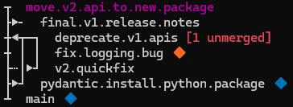
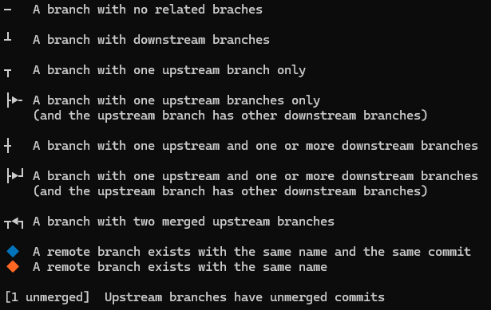

## git graph-branch

This tool provides a visual representation of the branches in your repository, including their relationships to upstream and merge branches.

### Quick Start

Install this tool using [uv][]:

[uv]: https://docs.astral.sh/uv/

```bash
$ uv tool install git+https://github.com/alicederyn/git-graph-branch.git
```

It will appear as a sub-command of `git`:

```bash
$ git graph-branch
```

### Help docs

```text
usage: git-graph-branch [-h] [--color] [--remote-icons] [-w] [--poll-every SECS]

Pretty-print branch metadata

options:
  -h, --help         show this help message and exit
  --color            Display colorized output; defaults to true if the output is a TTY
  --remote-icons     Display remote status icon; defaults to true if the output is a TTY

watch options:
  -w, --watch        Watch for changes and keep the graph updated
  --poll-every SECS  If watching, how often to poll for changes (default: 1.0)
```

### Sample output



Related branches are connected via lines; upstream branches are displayed further down the page. This allows rapidly grasping the structure of the branches.

To condense the information, the output is optimized for fonts like Hack or Cascadia Mono which correctly render box-drawing characters. It may display less well with other fonts.



### Recommended git configuration

git-graph-branch relies on your branches having upstream information set, which is not the case with git's defaults. To get the best out of git-graph-branch, I recommend a few configuration changes to your git checkout (`/path/to/repo/.git/config`, or `~/.gitconfig` if you would like to make these changes to every checkout):

```text
# Set upstream information when you run git checkout -b <branch>
[branch]
    autosetupmerge = always

# Ensure a plain git push will continue to work as expected
[push]
    default = simple
[remote]
    pushdefault = origin

# Keep branch history for longer
[gc]
    auto = 100000
```

If you have not used these defaults before, you may need to set up upstream information for your existing branches as a one-off. For instance, if `feature/foo` is going to be applied to `main`, run `git branch feature/foo --set-upstream-to=main`. Once you have made the config changes above, `git checkout main -b feature/foo` will set this upstream information for you automatically.
